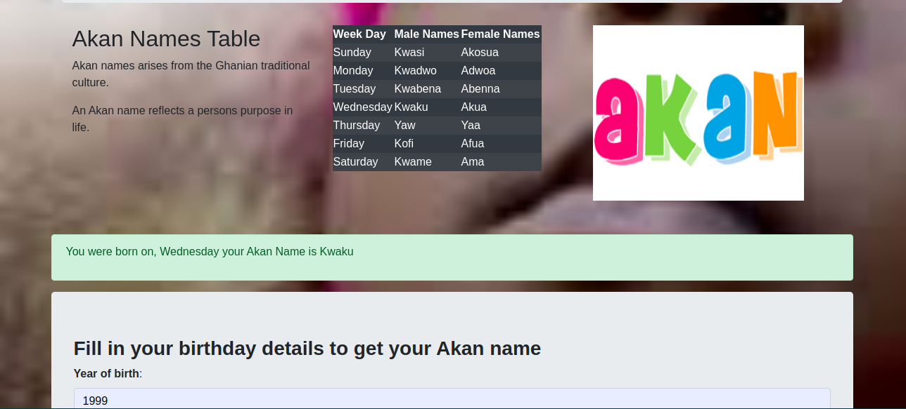

# AKAN NAMES
## [Author](https://github.com/batyrotich/)

## The project is about a web application that takes a user's birthday and calculates the day of the week they were born and then depending on their gender outputs their Akan Name. Akan names are derived from Ghanian culture.

[Akannames iol ink](https://batyrotich.github.io/independentproject2/)

## Technologies used
* HTML,CSS and BOOTSTRAP. HTML was adding content into the webpage, css and Bootrap was used in styling the webpage into a user friendly interface.
* JavaScript: used in making the website responsive.
## Requirements
- Personal Computer
- Network
- Visual Studio code
- JavaScript Console
- Github account.
## How to set up and install
Clone this repository to a location in your file system. command: git clone.
[https://batyrotich.github.io/independentproject2/](https://batyrotich.github.io/independentproject2/)

Open terminal command line then navigate to the root folder of the application. week2project

Open index.html on your Browser

[LICENSE](https://github.com/batyrotich/independentproject2/blob/eddah/LICENSE)

